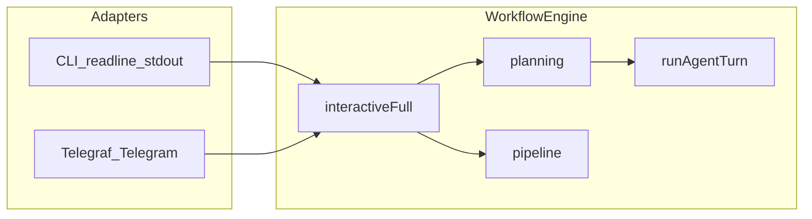

# Telegram bot, local server, and shared CLI core

Architecture plan for a Telegram-facing control plane bundled with `agentic-my-app`, reusing workflow logic and consult hooks via a transport adapter ([Telegraf](https://github.com/telegraf/telegraf)).

Source: kept in sync with [docs/telegram-interface-plan.md](docs/telegram-interface-plan.md); that file may be trimmed once implementation lands.

## Goals

- Ship a **Telegram-facing control plane** for `agentic-my-app` that reuses the **same workflow entry points and state machine** as the CLI (runs under `.agentic-my-app`-style artifacts, [`loadConfig`](src/config/loadConfig.ts), `runInteractiveFull` / `advanceWorkflow`, etc.).
- Treat **Telegram + Telegraf as a transport and UI adapter**: permissions, Q&A, and consultations flow through the same **`HumanConsultHooks`-style** prompts and **approval gates** as the terminal path, not a parallel workflow.
- Run **locally** with the published package: **`telegraf`** dependency, **`bin`** subcommand (e.g. `agentic-my-app telegram` or `serve-telegram`-style alias via Commander only), clear **env-based configuration** (`TELEGRAM_BOT_TOKEN`, allowlists). **Polling** is the production transport choice (see Process / server lifecycle below).
- **Observe** runs with structured logs tying **`runId`** + **`taskId`** (inferred from **GitHub issue** or **other upstream task identifier**) ↔ Telegram **`chat_id`** / **`user_id`**.

## Current CLI touchpoints (file pointers)

| Area | Location | Role |
|------|----------|------|
| **CLI commands** | [`src/cli.ts`](src/cli.ts) | Commander: `init`, `smoke`, `full`/`auto`, `prototype`, `issue`, `task`, `plan`, `workflow`/`run`, `approve`, `implement`, `verify`, `finalize`, `monitor-pr`, `resume`, `cancel`, `status`, etc. `full` builds **shared readline** → `runInteractiveFull`. |
| **Interactive “full” flow** | [`src/workflow/interactiveFull.ts`](src/workflow/interactiveFull.ts) | `workflowStepLog` → `process.stdout`. Spec/decomposition approval via `readline` y/N (`confirmRl`). Pauses readline during background work. Orchestrates planning → implement → verify → finalize → `monitorPullRequest`. |
| **Planning + human consult** | [`src/workflow/planning.ts`](src/workflow/planning.ts) | `openPlanningHumanConsult`: TTY readline (or **shared** readline from CLI), wires **`HumanConsultHooks`**. **Only place** that passes `consult:` into `runAgentTurn` today. |
| **Consult protocol + tools** | [`src/sdk/runAgentTurn.ts`](src/sdk/runAgentTurn.ts) | **`HumanConsultHooks`**: `askHumanMarker` loops, `pauseBeforeTools` + `shouldConsultBeforeTool` → `question()`; stream uses **`process.stdout.write`**. |
| **Ask-human markers** | [`src/util/humanConsult.ts`](src/util/humanConsult.ts) | Parses/strips `<AGENTIC_MY_APP_ASK_HUMAN>` / legacy `<ORCHESTRATOR_ASK_HUMAN>`; `extractAgenticMyAppAskHuman` (used in [`runAgentTurn`](src/sdk/runAgentTurn.ts) loop); `stringifyToolPayload` for consult prompts. |
| **Non-interactive pipeline** | [`src/workflow/pipeline.ts`](src/workflow/pipeline.ts) | `advanceWorkflow`, `requestCancel` (writes `cancelRequested` on disk). No readline. |
| **Config** | [`src/config/loadConfig.ts`](src/config/loadConfig.ts), [`src/config/types.ts`](src/config/types.ts), [`src/config/defaults.ts`](src/config/defaults.ts) | YAML merge, `consultHuman.*`, `workflow.approval` / `autonomy`. Env in [`src/util/agenticEnv.ts`](src/util/agenticEnv.ts) (`AGENTIC_MY_APP_CONSULT_HUMAN`, stream, log stdout). |
| **Logging** | [`src/logging/logger.ts`](src/logging/logger.ts) | JSONL + optional stdout/stderr; **`runId` + `component` + `event`**; `redactSecrets`. No Telegram fields yet. |
| **Implement / verify / monitor** | [`src/workflow/implementCandidates.ts`](src/workflow/implementCandidates.ts), [`src/workflow/verifyAndReview.ts`](src/workflow/verifyAndReview.ts), [`src/workflow/finalizePr.ts`](src/workflow/finalizePr.ts), [`src/monitor/prMonitor.ts`](src/monitor/prMonitor.ts) | **`runAgentTurn` without `consult`** in these files (fact). |

**Important fact:** CLI consult **today is concentrated in planning** ([`planning.ts`](src/workflow/planning.ts) + [`runAgentTurn`](src/sdk/runAgentTurn.ts)) plus **y/N gates** in [`interactiveFull.ts`](src/workflow/interactiveFull.ts). Implement and later phases **do not** pass `HumanConsultHooks` — **no** terminal tool-confirm or ASK_HUMAN loop there.

## Architecture (high level)



### Separation of concerns

1. **Workflow engine / use-cases** — Unchanged: `runInteractiveFull`, `runPoAndDecomposition`, `advanceWorkflow`, `runImplementCandidates`, etc., on **`LoadedConfig` + run `paths` + `state.json`**.
2. **CLI adapter** — `readline` + stdout/stderr + `workflowStepLog`; composes `sharedReadline` with planning consult ([`src/cli.ts`](src/cli.ts)).
3. **Telegram adapter (new)** — Telegraf `Context` → **`UserChannel`** (or inject **`HumanConsultHooks` + approval callbacks** from Telegram): send/**edit** messages, split long text; **inline keyboards** or slash commands for y/N and **tool approve / skip**; **sparse outbound** (milestones, consult, errors; delay OK) with **backoff + send queue** to avoid flood limits.
4. **Process / server lifecycle** — **Long polling:** `Telegraf` + `bot.launch()` — **no inbound HTTP** from Telegram; outbound HTTPS to `api.telegram.org`; fits **local-only** behind NAT, avoids webhook TLS setup. **Webhook** not planned for this slice; if added later (tunnel / public HTTPS), default remains polling.

### Session model

- **1:1 private chat only** — No groups or forum topics; do not rely on `message_thread_id`; optionally single “DM only” reply then ignore non-private updates.
- **Primary key:** `chat_id` for the operator dialogue.
- **`taskId`:** Do not mint arbitrary IDs. **Derive** from platform/work-intake (e.g. **`owner/repo#123`** from **`/run issue owner/repo#123`**, same as `full --issue`); normalize to one canonical form in UX (e.g. owner casing — TBD). Other entry points (`task` / `plan` / `workflow` when added) contribute a **stable slug** (tracker key, Notion shorthand, or **deterministic** path-based slug — **not** UUIDs).
- **`/reply` protocol** — Slash commands, **`/reply`-armed** payloads, or non-consult handling; **plain messages never** answer `HumanConsultHooks.question`, even with one session. **`/reply <taskId>`** → **exactly one** following text message is the answer; then disarm.
- **Mapping:** `(chat_id, taskId) →` workflow execution; **`inferTaskId(...)`** matches Telegram. Persist **`runId` + `taskId`** in memory and **optionally a session file** under artifacts root for crash recovery.
- **Concurrency:** Policy for second **`/run`** with same upstream **`taskId`** — queue vs reject vs suffix (e.g. `owner/repo#123~2`) — decide at implementation time.
- **Multi-user:** Allowlisted private chats; **one operator persona** per deployment is nominal.

## Parity with CLI interactivity

| CLI behavior | Implementation today | Telegram direction |
|--------------|----------------------|-------------------|
| Consult Q&A | `HumanConsultHooks.question` + readline ([`planning.ts`](src/workflow/planning.ts)) | Same hooks; prompt includes inferred **`taskId`**; arm only after **`/reply <taskId>`**; next message = answer; **`/reply` always required**. |
| ASK_HUMAN blocks | `extractAgenticMyAppAskHuman` loop in [`runAgentTurn`](src/sdk/runAgentTurn.ts) | Same logic; I/O via Telegram. |
| Tool pause | `consult.question` in `consumeStream` | Same; optional inline keyboard “Approve” / “Edit instruction”. |
| Spec/decomposition | `confirmRl` in [`interactiveFull.ts`](src/workflow/interactiveFull.ts) | Dedicated messages + y/n or buttons; then **`approveSpec` / `approveDecomposition`** as CLI. |
| Stream | `process.stdout.write` in `consumeStream` | Injectable **stream sink** (see Gaps): Telegram messages or **document** for long output. |
| Progress | `workflowStepLog` → stdout | **`onLog` → logger always**; Telegram = high-signal unless **debug**. |
| Cancel | `requestCancel` + state | **`/cancel <taskId>`** or button keyed by **`taskId`** → same API. |
| Timeouts | Blocking readline (no timeout on **`question`**) | Optional **timeout** at **consult port** for Telegram. |

**Fact:** implement/verify/finalize/monitor **do not** pass consult today — stretch “full tool-consult” means extending [`implementCandidates`](src/workflow/implementCandidates.ts) et al., not only Telegram.

## UX flows (examples)

1. **Start full from issue** — Allowlisted DM: **`/run issue owner/repo#123`** → same as **`full --issue`** → `taskId` = inferred ref + internal `runId` → planning → consult (prompt shows `taskId`) → **`/reply owner/repo#123`** then answer message (repeat) → spec approval → pipeline → **sparse** Telegram unless debug.
2. **`/reply`** — Bare **`/reply`**: list active **`taskId`s**, usage hint, **does not arm**. **`/reply <taskId>`**: arms once; next text answers if waiter matches; **`taskId`** = inferred upstream id, not opaque token; plain messages otherwise never consult answers.
3. **Resume / status** — **`/status`** / **`/status <taskId>`** reads `state.json`; **`/cancel <taskId>`** → `requestCancel`; **`taskId`** is what operator used for **`/run`**; **`runId`** internal / logs-first.
4. **Duplicate intake** — Two simultaneous runs, same **`taskId`**: **`runId`** still unique; choose reject, queue, or disambiguating suffix; document choice.
5. **Blocked** — Phase **`BLOCKED_NEEDS_USER`** → send `lastError`, suggest **`/status <taskId>`** or fix on disk.

## Refactors before or alongside Telegram (gaps)

1. **`HumanConsultHooks` + TTY** — [`openPlanningHumanConsult`](src/workflow/planning.ts) returns **null** if not TTY; Telegram must **inject** hooks (new parameter or factory).
2. **`runAgentTurn` stdout** — `consumeStream` / **`resumeAgentTurn`** use **`process.stdout.write`**; add optional **`onStreamChunk`** / **`streamSink`**.
3. **`workflowStepLog`** — [`interactiveFull.ts`](src/workflow/interactiveFull.ts): **`onLog: (s: string) => void`** or reuse logger.
4. **`interactiveFull` readline** — Abstract **`confirmRl(rl, ...)`** to **`confirm(prompt) => Promise<boolean>`** from session UI; prefer **`runInteractiveFull({ ui: TerminalUi | TelegramUi })`** over duplicating steps.
5. **Consult coverage** — Implement/verify/finalize/monitor: **no consult hooks** today; “parity” there is “no consult” unless codebase is extended.

### Optional TypeScript sketches (ports)

```ts
/** Narrow UI contract for interactive full + planning consult */
export type InteractiveUi = {
  log: (line: string) => void;
  confirm: (prompt: string) => Promise<boolean>;
};

/** Drop-in replacement for TTY HumanConsultHooks.question / log */
export type ConsultChannel = Pick<
  import("../sdk/runAgentTurn.js").HumanConsultHooks,
  | "question"
  | "log"
  | "askHumanMarker"
  | "pauseBeforeTools"
  | "confirmAllTools"
  | "maxConsultRounds"
>;

/** Optional: stream chunks from model (requires runAgentTurn change) */
export type AgentStreamSink = { write: (chunk: string) => void };

export type TelegramSession = {
  runId: string;
  /** Inferred from intake (e.g. owner/repo#issue); operator `/reply`s with this stable ref. */
  taskId: string;
  chatId: number;
  userId: number;
  cwd: string;
};
```

## Bundling and config

- **`telegraf`** in [`package.json`](package.json) `dependencies`.
- **`agentic-my-app telegram`** (or Commander-only equivalent of `serve-telegram`); **no second `bin`** entry required — one [`dist/cli.js`](src/cli.ts).
- Load config from cwd; **`TELEGRAM_BOT_TOKEN`**, optional **`AGENTIC_MY_APP_TELEGRAM_ALLOWED_CHATS`** (comma-separated). **Polling only** for MVP (no webhook URL).

- **`--autonomous` (and/or YAML):** mirror CLI — skip/auto-approve where workflow permits; still send milestones/errors consistent with autonomy.
- **Debug (flag / env):** verbose structured logs to chat or log tap; optionally model **reasoning** where SDK exposes it; normal mode stays quiet.

## Security

- **Bot token:** env only; never log raw token — **verify** [`redactSecrets`](src/logging/logger.ts) covers `TELEGRAM_BOT_TOKEN`-style values or extend env-name allowlist.
- **Allowlist:** only allowlisted **`chat_id`** (and optionally **`user_id`**) may trigger runs; others ignored or one “unauthorized” reply.
- **SSRF (future webhook):** if webhook transport is added, accept only Telegram’s POST flow (**`secret_token`** validation, etc.); **do not** fetch arbitrary URLs from user messages for “preview” unless strictly controlled.
- **Dangerous operations:** workflow can run **shell/git** via agents; **same trust model as CLI** (machine + token access); Telegram adds **remote** trigger → **allowlist mandatory** for MVP.

## Observability

- Extend **`createLogger`** (or thin wrapper) with **`data: { telegramChatId, telegramUserId }`** on events from the Telegram command path.
- **Correlation:** structured lines include **`runId`**, **`taskId`** when known (same token as Telegram, e.g. `owner/repo#N`), plus Telegram ids in **`data`** for JSONL joinability.

## Resolved product decisions

| Topic | Decision |
|-------|----------|
| **Group chats / threads** | **Not supported.** 1:1 private only; no `message_thread_id` semantics. |
| **Rate limits / flood control** | **Backoff + outbound queue**; few important messages; latency OK; avoid dense streams in normal mode. |
| **Pending `question()` / stray messages** | **`/reply <taskId>`** always before answer (including single-session). **`/reply` alone** lists only; **never** arms. **Plain messages** do not consume waiters. |
| **Autonomous vs interactive** | **`--autonomous`** aligned with CLI; **debug mode** for full logs / reasoning visibility. |
| **Webhook TLS** | **Polling** for local MVP; webhook additive later. |
| **CLI parity surface** | **Start with `full`** in Telegram MVP; clear extension points for **`plan` / `workflow` / …** on same UI port. |
| **`taskId` source** | **Inferred** from intake; not random UUIDs; collision handling aligns with concurrency policy (UX §4). |

## Phased delivery

Tracked as todos in this file’s YAML frontmatter, tagged **`[Foundation]`**, **`[MVP]`**, **`[Mid]`**, **`[Later]`**, **`[Parity / stretch]`**.

- **MVP**: `telegram` command; polling; allowlist; **mirror `full` only**; discrete `plan`/`workflow`/etc. **not** required but share same **UI port / adapter** when added later; commands: start full run (issue or task — exact UX TBD), **`/reply`** / **`/reply <taskId>`**, **`/status`** / **`/status <taskId>`**, **`/cancel <taskId>`** with **`taskId` = `inferTaskId`**; **`UserChannel` / consult port:** Telegram **`HumanConsultHooks` for planning-only** (matches current code); **`runInteractiveFull`:** inject approval + log adapters (**`runInteractiveFull({ ui: … })`** preferred over duplicating steps); **`--autonomous`** + **debug** (CLI flags and/or YAML); document env mirrors if any.
- **Mid**: stream sink + throttle/chunking (4096); optional timeouts on consult port; optional inline keyboards for tool flows where consult exists.
- **Later**: discrete Telegram commands for `plan` / `workflow` / … via same adapter.
- **Stretch**: thread consult into implement/verify/finalize/monitor if product requires it.

## Verification (when implementing)

- Lint/typecheck package; smoke `telegram` with mock or test token where feasible; manual DM flow for `/run` → consult → `/reply` → approval.

## Fact note

Grounded in repo paths cited above. Anything not inspected (e.g. exact Telegraf version API, full [`prMonitor`](src/monitor/prMonitor.ts) behavior) is **labeled** in this plan rather than assumed.
