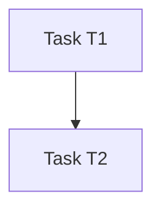

# Task decomposition

**Run ID:** `{{RUN_ID}}`  
**Spec:** `spec.md` (same run directory)  
**Created:** `{{CREATED_AT}}`

## Task graph

## Tasks

| ID | Description | Requirement IDs | Dependencies | Risk | Complexity (S/M/L) |
|----|---------------|-----------------|--------------|------|-------------------|
| T1 | | REQ-001 | — | low | M |

## Files / areas likely affected

- 

## Test plan per task

| Task | Tests to add or extend |
|------|-------------------------|
| T1 | |

## Verification expectations

- Lint, typecheck, unit/integration/browser per repo `commands` in config.

## Suggested candidate strategies

- Minimal-change candidate
- Test-first candidate
- Security-focused candidate
- UX/browser-focused candidate

## Required approvals

Per workflow config (`approval.afterDecomposition`). Default: **human approval required** before implementers run.
